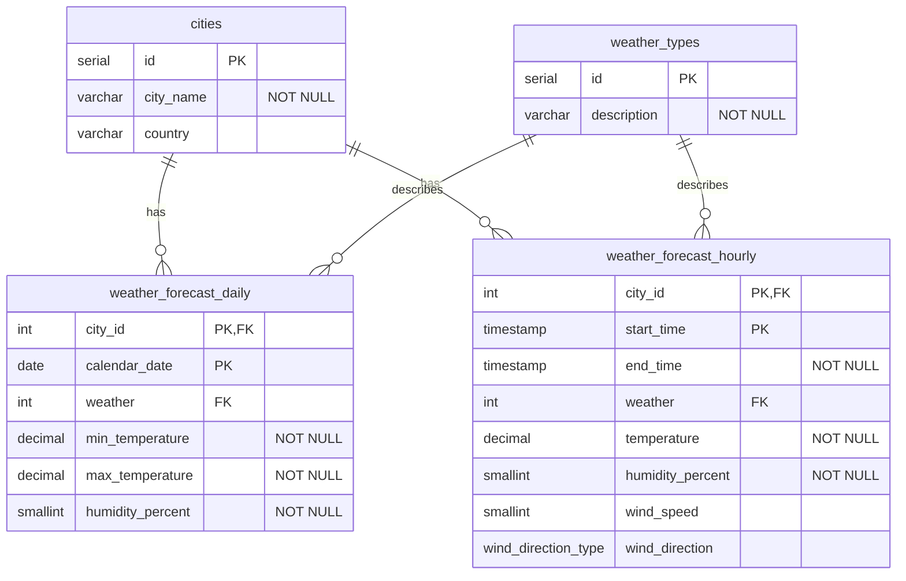

# SkyCast

 SkyCast je DB na sledovanie aktuálneho počasia. Ukladá údaje o mestách, počasí, teplote, zrážkach a čase merania. Používateľ si môže vybrať mesto a zobraziť počasie. Cieľom je vytvoriť jednoduchú a prehľadnú aplikáciu, ktorá umožní pracovať s meteorologickými údajmi.



## Úlohy

### 1. Slnečné mestá
Vypíšte všetky mestá, ktoré majú v denných predpovediach **slnečné počasie**.

**Zobrazte:**
- názov mesta
- typ počasia
- dátum

2. Vypíšte hodinové predpovede v čase od 14:00 do 19:00.
   Zobrazte názov mesta, dátum, časový interval, počasie, teplotu,
   vlhkosť a rýchlosť vetra (v km/h). Výsledky zoraďte podľa času začiatku.

<details>
  <summary>Riešenie</summary>

  ```sql
SELECT
   city_name AS city,
   wt.description AS weather_type,
   calendar_date
FROM
   weather_forecast_daily AS d
      JOIN cities c ON d.city_id = c.id
      JOIN weather_types AS wt ON d.weather = wt.id
WHERE
   wt.description = 'sunny';
  ```
</details>

### 2. Hodinové predpovede popoludní
Vypíšte hodinové predpovede v čase **od 14:00 do 19:00**.

**Zobrazte:**
- názov mesta
- dátum
- časový interval
- počasie
- teplotu
- vlhkosť
- rýchlosť vetra (v km/h)

**Zoradenie:** podľa času začiatku.

<details>
  <summary>Riešenie</summary>

  ```sql
SELECT
   c.city_name,
   h.start_time::date                                  AS forecast_date,
   CONCAT(h.start_time::time, ' - ', h.end_time::time) AS time_range,
   wt.description                                      AS weather,
   h.temperature,
   h.humidity_percent,
   CONCAT(h.wind_speed, ' km/h')                       AS wind_speed
FROM
   weather_forecast_hourly AS h
      JOIN cities AS c ON h.city_id = c.id
      JOIN weather_types AS wt ON h.weather = wt.id
WHERE
   h.start_time::time >= '14:00:00'
    AND h.end_time::time <= '19:00:00'
ORDER BY
   h.start_time;
  ```
</details>

### 3. Priemerná teplota
Vypíšte priemernú teplotu pre jednotlivé mestá. 

**Zobrazte:**
- mesto
- dátum
- počasie
- priemernú
- teplotu 
- vlhkosť

**Zoradenie:** podľa priemernej teploty zostupne.

<details>
  <summary>Riešenie</summary>

  ```sql
SELECT
   c.city_name,
   d.calendar_date,
   wt.description AS weather,
   ROUND((d.min_temperature + d.max_temperature) / 2, 1) AS average_temperature,
   d.humidity_percent
FROM weather_forecast_daily AS d
        JOIN cities AS c ON d.city_id = c.id
        JOIN weather_types AS wt ON d.weather = wt.id
WHERE d.min_temperature IS NOT NULL
  AND d.max_temperature IS NOT NULL
ORDER BY average_temperature DESC;
  ```
</details>

### 4. Hodinové predpovede vyššie ako 20 °C
Vypíšte hodinové predpovede, pri ktorých je teplota vyššia ako 20 °C.

**Zobrazte:**
- mesto
- dátum
- počasie
- teplotu

**Zoradenie:** podľa teploty zostupne.


<details>
  <summary>Riešenie</summary>

  ```sql
SELECT
   c.city_name,
   h.start_time::date AS date,
    wt.description AS weather,
    h.temperature
FROM weather_forecast_hourly AS h
   JOIN cities AS c ON h.city_id = c.id
   JOIN weather_types AS wt ON h.weather = wt.id
WHERE h.temperature > 20
ORDER BY h.temperature DESC;
  ```
</details>

### 5. Slnečné počasie
Vypíšte všetky mestá, ktoré majú v denných predpovediach slnečné počasie.
**Zobrazte:**
- názov mesta
- typ počasia 
- dátum

**Zoradenie:** podľa názvu mesta.

<details>
  <summary>Riešenie</summary>

  ```sql
SELECT
   c.city_name,
   wt.description AS weather,
   d.calendar_date
FROM weather_forecast_daily AS d
        JOIN cities AS c ON d.city_id = c.id
        JOIN weather_types AS wt ON d.weather = wt.id
WHERE wt.description = 'rainy'
ORDER BY c.city_name;
  ```
</details>