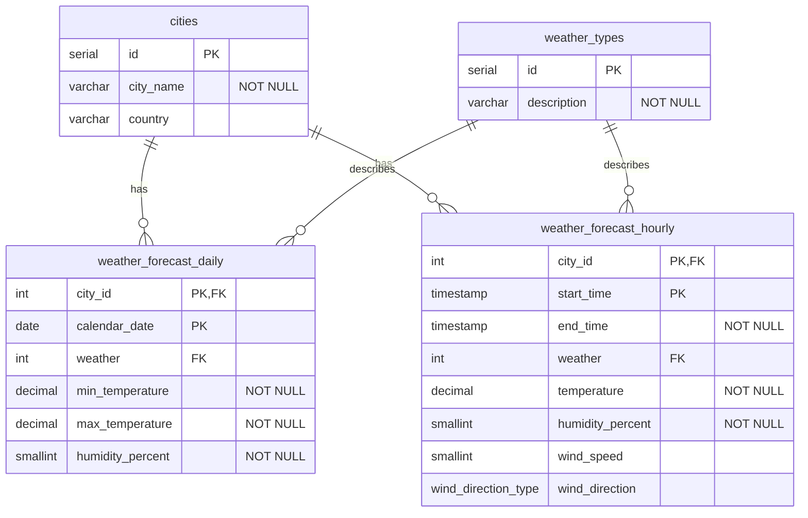

# SkyCast

 SkyCast je DB na sledovanie aktuálneho počasia. Ukladá údaje o mestách, počasí, teplote, zrážkach a čase merania. Používateľ si môže vybrať mesto a zobraziť počasie. Cieľom je vytvoriť jednoduchú a prehľadnú aplikáciu, ktorá umožní pracovať s meteorologickými údajmi.

