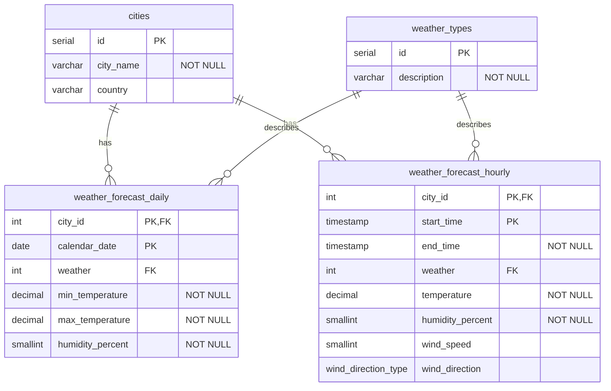

# SkyCast

 SkyCast je DB na sledovanie aktuálneho počasia. Ukladá údaje o mestách, počasí, teplote, zrážkach a čase merania. Používateľ si môže vybrať mesto a zobraziť počasie. Cieľom je vytvoriť jednoduchú a prehľadnú aplikáciu, ktorá umožní pracovať s meteorologickými údajmi.

## Úlohy

### 1. Slnečné mestá
Vypíšte všetky mestá, ktoré majú v denných predpovediach **slnečné počasie**.

**Zobrazte:**
- názov mesta
- typ počasia
- dátum

2. Vypíšte hodinové predpovede v čase od 14:00 do 19:00.
   Zobrazte názov mesta, dátum, časový interval, počasie, teplotu,
   vlhkosť a rýchlosť vetra (v km/h). Výsledky zoraďte podľa času začiatku.

### 2. Hodinové predpovede popoludní
Vypíšte hodinové predpovede v čase **od 14:00 do 19:00**.

**Zobrazte:**
- názov mesta
- dátum
- časový interval
- počasie
- teplotu
- vlhkosť
- rýchlosť vetra (v km/h)

**Zoradenie:** podľa času začiatku.

### 3. Priemerná teplota
Vypíšte priemernú teplotu pre jednotlivé mestá. 

**Zobrazte:**
- mesto
- dátum
- počasie
- priemernú
- teplotu 
- vlhkosť

**Zoradenie:** podľa priemernej teploty zostupne.

### 4. Hodinové predpovede vyššie ako 20 °C
Vypíšte hodinové predpovede, pri ktorých je teplota vyššia ako 20 °C.

**Zobrazte:**
- mesto
- dátum
- počasie
- teplotu

**Zoradenie:** podľa teploty zostupne.

### 5. Slnečné počasie
Vypíšte všetky mestá, ktoré majú v denných predpovediach slnečné počasie.
**Zobrazte:**
- názov mesta
- typ počasia 
- dátum

**Zoradenie:** podľa názvu mesta.
